# DA-Project
Softeer DataArchitect Project

## 주제
- 전사 회의실 예약 시스템

## 담당자
> 주요 담당 도메인
>> 주요 담당을 적극적으로 담당하고, 그 외 영역도 유기적으로 협업
- 전길원 : 예약 (예약 관련 엔터티)
- 이관형 : 자원 (회의실 / 비품 등)
- 김용진 : 조직 (직원 등)

## 프로젝트 진행
- 목차
    1. [업무 주제 선정](#업무-주제-선정-715)
    2. [1차 통합 요구 사항 정의](#1차-통합-요구-사항-정의-715)
    3. [분업 및 개별 모델링](#분업-및-개별-모델링-715)
    4. [개별 진행 후 토론](#개별-진행-후-토론-716)
    5. [개별 논리적 모델링 진행 결과 통합](#개별-논리적-모델링-진행-결과-통합-717)
    6. [코드 엔터티 통합](#코드-엔터티-변경718)
    7. [논리 모델링](#논리-모델링718)
    8. [도메인 정의서](#도메인-정의-표준화-진행-718)
    9. [물리 모델링 진행](#물리-모델링-진행-718)

#### **업무 주제 선정** (7/15)
> 다같이 각 주제에 대한 생각을 나누고, 1,2,3 순위 투표를 하여 **전사 회의실 예약 시스템**으로 선정

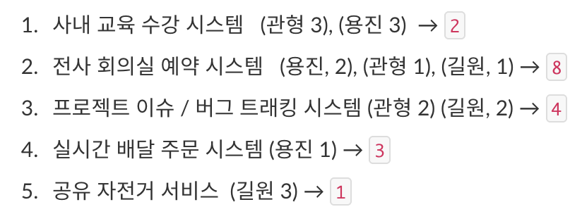
---
#### **1차 통합 요구 사항 정의** (7/15)
> 팀 전체 함께 의논하며, 요구 사항을 1차 정리

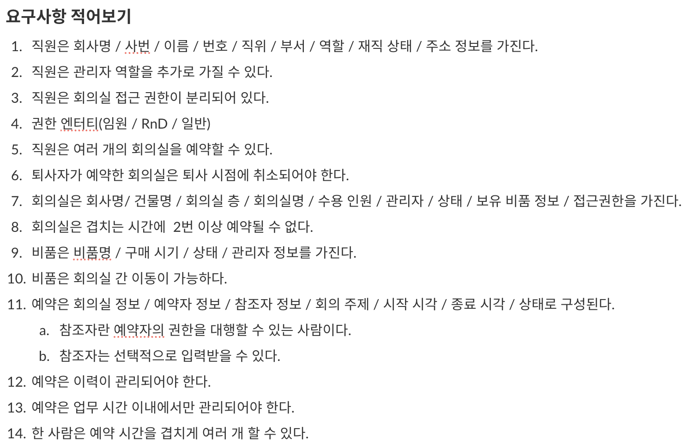
---
#### **분업 및 개별 모델링** (7/15)
> 각자 개별 도메인 영역 선정 후, 모델링 진행
- 도메인 영역 선정
    - 김용진 : 조직, 인사
    - 전길원 : 예약 시스템
    - 이관형 : 자원

- 개별 모델링 후, 토론 진행
    - 관형 : 권한을 숫자(1,2,3,4)로 표현하는 것이 R&D, 일반, 임원 등 역할명보다 명확하다고 동의
        - 각 숫자가 여러 권한 집합을 의미하는 것으로 표현 (1:M 대응 관계)
    - 관형 : 권한 등급 숫자를 사전 테이블로 관리할지, 아니면 직원 테이블에 직접 포함할지는 추가 논의가 필요
        - 방식 1: 권한 등급 숫자 자체는 직접 기입, 집합은 사전으로 표현
        - 방식 2: 권한 관련 엔터티 추가
    - 길원 : 성능상 이유로 직원 테이블을 직원 기본 및 직원 상세로 분리하는 것 제안
        - 직원 테이블이 가장 많은 참조가 일어남
            - 참조에 필요한 주요 내용만 기본에 남기고, 그 외의 내용은 상세로 분리
    - 길원 : 예약 엔티티에 예약자는 표현하되, 참조자는 예약 참조자 테이블을 따로 구성
        - 예약 화면에서 예약자는 표시되어야 하는 반면, 예약 참조자는 권한 확인용으로만 필요하다 여겨 예약자와 참조자를 분리 관리하는 것으로 제안
        - 용진 : 예약자와 참조자를 묶고, 예약 정보를 따로 분리해야 하지 않을지 고민 제시
            - 예약자와 참조자가 예약을 관리한다는 성격은 같으므로, 둘이 합쳐야 한다고 생각
    - 용진 : 회의실 관리자를 별도 엔티티로 분리하고, 직원 테이블과 연결하는 구조를 제안 
    - 전체 : 수용인원은 최대값 하나로 관리하되, 권장인원 개념으로 제시
---
#### **표준 용어 사전 구축** (7/16)
> 팀 전체 토론을 통해 표준 용어 사전 구축
- [토론 중 의견 조율 내역 일부 정리](conflict.md)
- [표준 용어 사전 링크](https://docs.google.com/spreadsheets/d/1snEixFD_zC0ne-C4jorOZCpKL2yBfZhCpkceofQiKIA/edit?usp=sharing)

1. **각자 제작한 모델링 결과 기반 엔터티 및 속성명 모두 취합**
    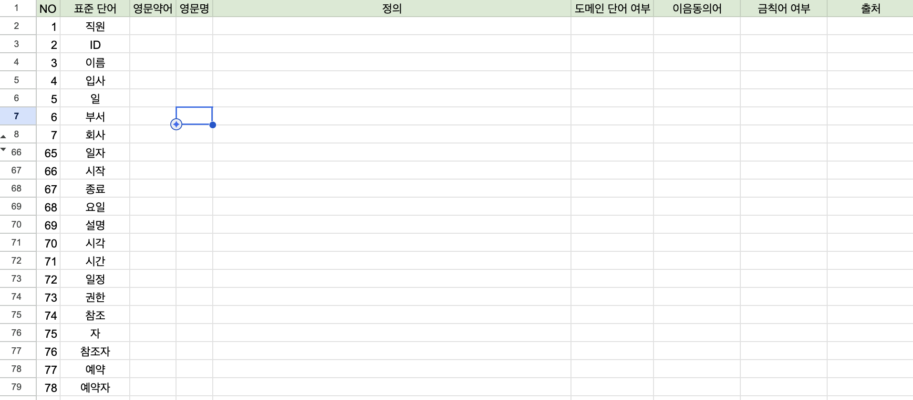
2. **용어 중복 제거 및, 정의 작성, 단어 결정**
    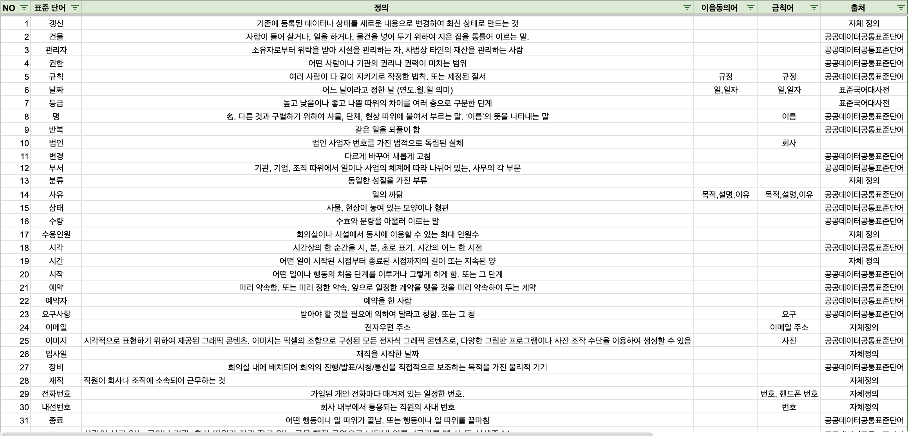
    - 중복 작성된 내용 제거
    - 단어를 검수하며 특성을 정확히 나타내는 단어로 결정
        - ex, 일자/일시/날짜 -> 날짜로 결정
    - 단어별 정의 작성
    - 이음 동의어 및 금칙어 작성
    - 공공데이터표준과 표준국어대사전을 참고함.
        - 이 데이터에 없거나 만족스러운 정의가 아닌 단어는 자체 정의함
        
3. **영문명 매핑 진행**
    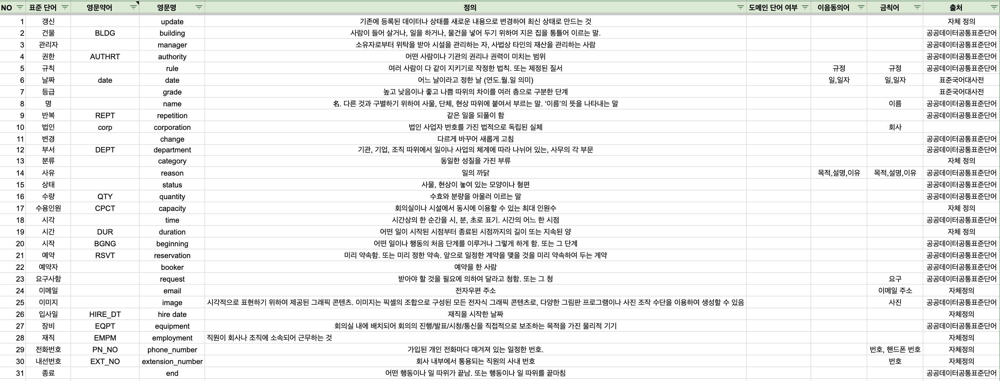
    - 공공데이터표준, AI를 이용하여 가장 적절한 단어를 찾음
        > 공공데이터표준에 나와있는 것이 적절하지 않다고 느껴지면, AI를 이용하거나 검색으로 가장 적절한 단어를 찾음
        >> ex, 전화번호 : telephone number(표준) -> phone number(자체정의)
    - 8자 이상의 단어는 약어를 추가 정의함

---
#### **개별 진행 후 토론** (7/17)
> 작일 개별 모델링 결과에 대한 토론을 기반으로 각자 다시 진행 후, 토론

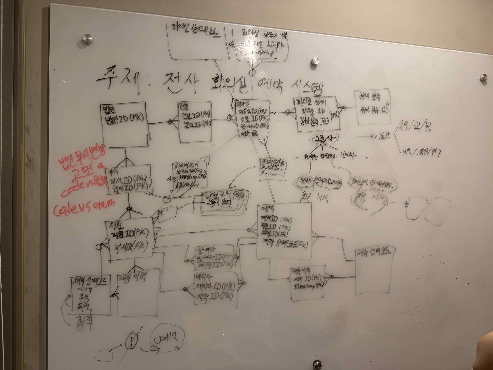
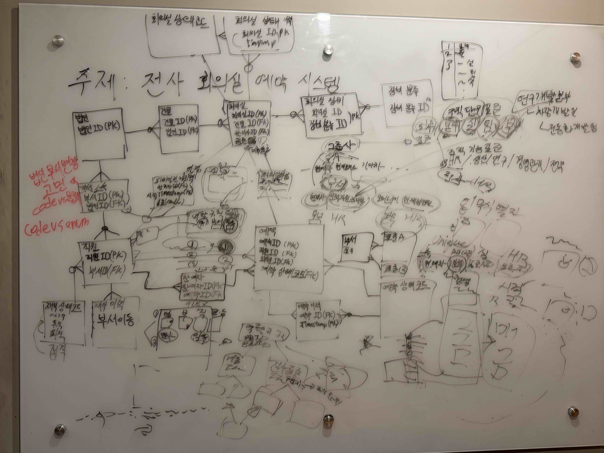

---
#### **개별 논리적 모델링 진행 결과 통합** (7/17)
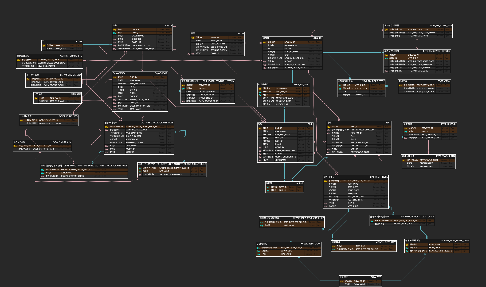

---
#### **코드 엔터티 변경**(7/18)
> 약 11개로 나눠진 코드 엔터티를 코드 유형과 유형별 코드 번호로 통합 정리

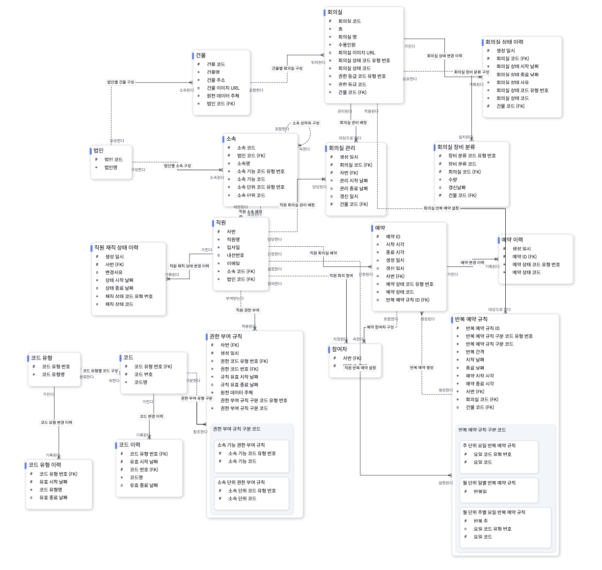

---
#### **논리 모델링**(7/18)
1. 관계명 작성
    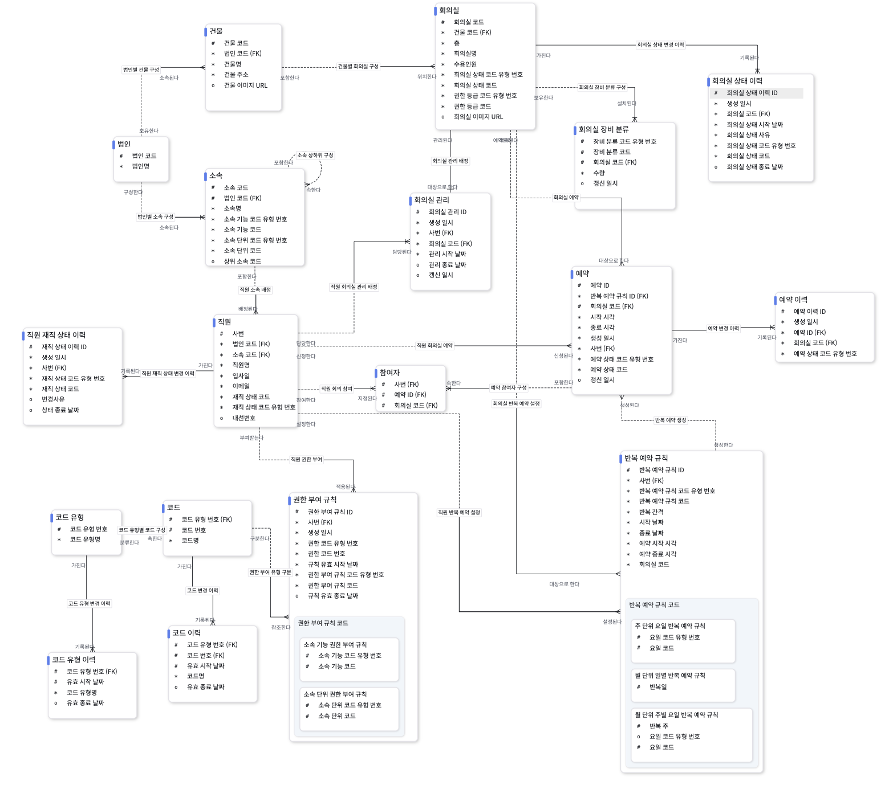
2. 엔터티/속성 정의 작성
    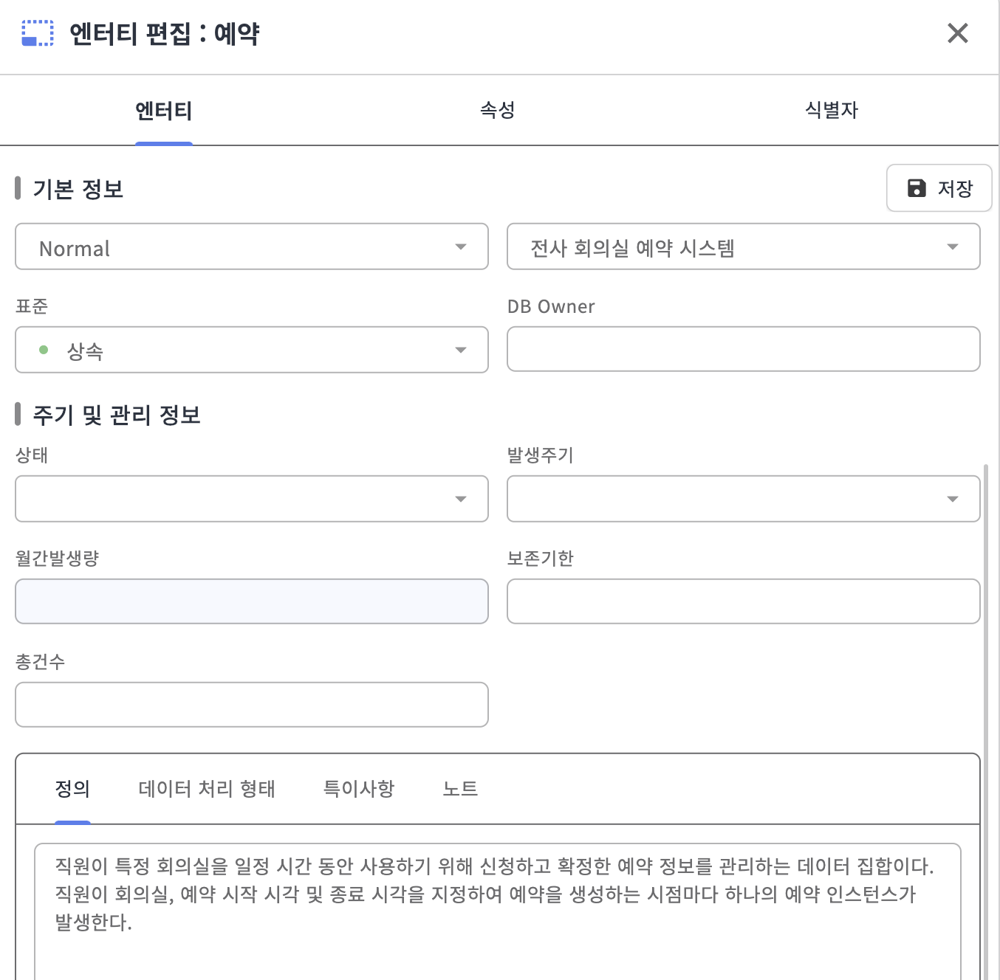
    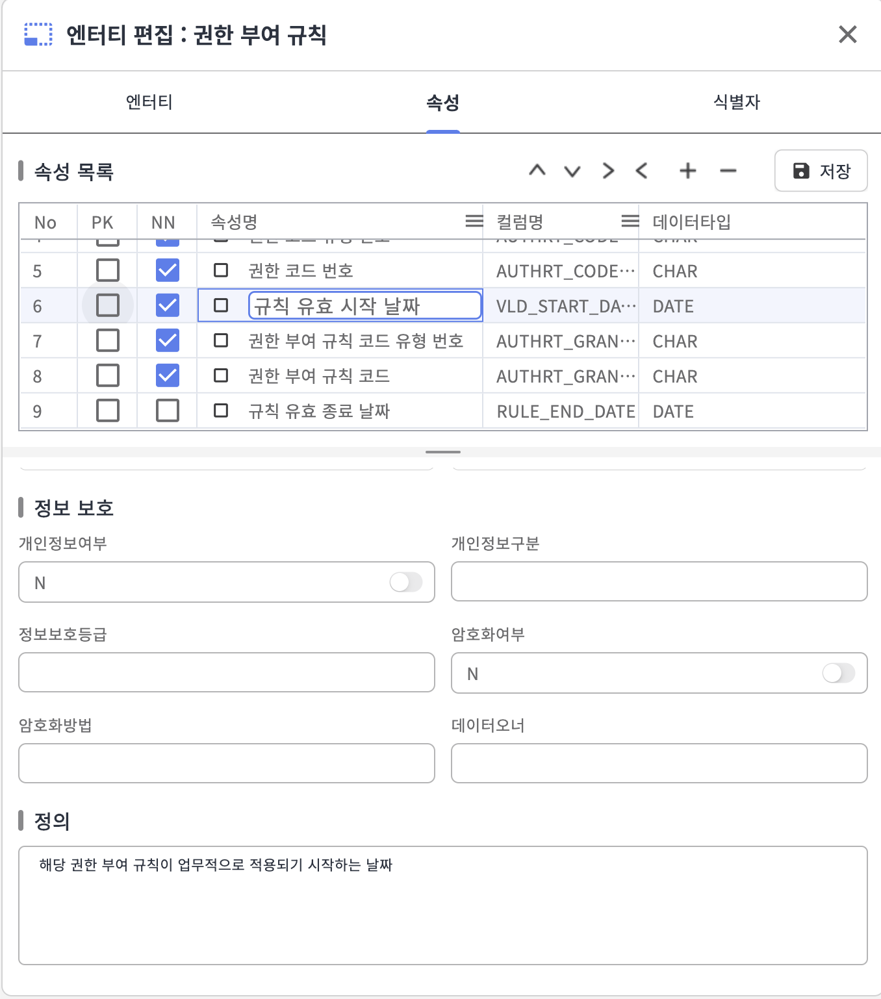
3. 업무 식별자 / 핵심 식별자 파악 및 설정
    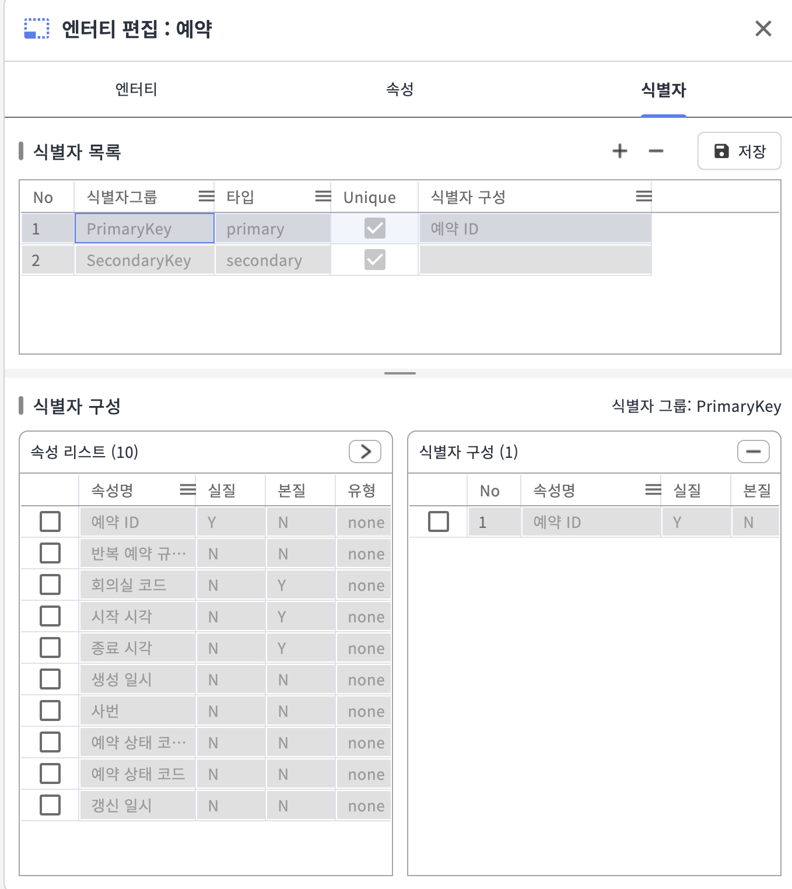

---
#### **도메인 정의 표준화 진행** (7/18)
- [도메인 정의서 엑셀](https://docs.google.com/spreadsheets/d/1-aiC4OLtqCO5uuAHhPRR5oaiPypogyEEA7w50gN1GFU/edit?usp=sharing)
1. 엔터티 속성명 종합
    > 엔터티랑 속성명 종합

    

2. 접미어 분리
    > 2자/3자/4자로 접미어 분리 진행 (유사 분류를 찾기 위함)

    

3. 접미어 기반 유사 분류끼리 통합
    > 접미어들 기반으로 공통 추출 후, 공통 접미어 분류

    

4. 도메인 정의서 분류 및 도메인 추출
    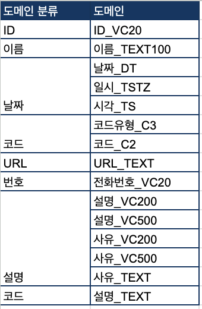

5. 도메인 정의서 완성
    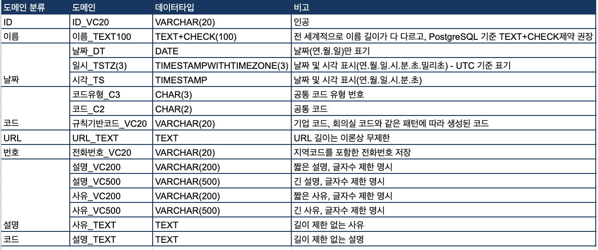

---
#### **물리 모델링 진행** (7/18)

1. 영문명 매핑 및 데이터타입 결정
    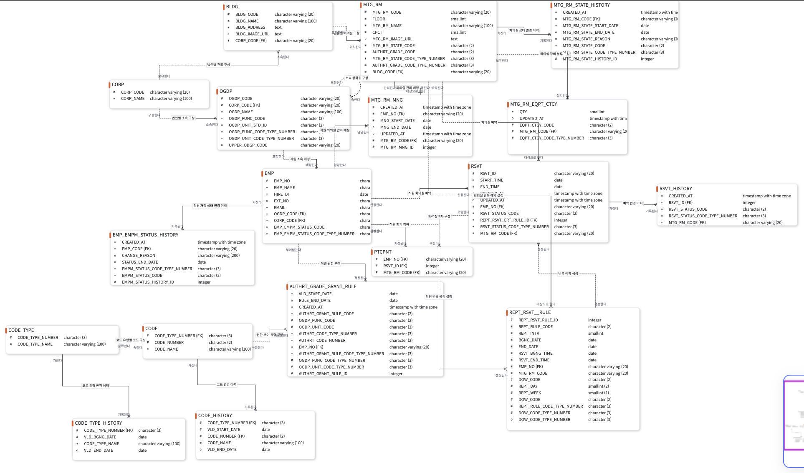

2. 성능 평가 진행
    - 테스트 시나리오 별 성능 평가 진행
        1. 현대차 그룹 전사 330,000명의 0.1%가 동시 시간대에 예약 진행을 한다고 가정
            - 3300명 동시 예약 신청 시, 지연율 측정
            - 3300명 동시 예약 시, 10%(330건) 예약 충돌 발생 처리 확인
        2. 1년 단위 백업 가정, 예약 데이터 1200만개가 쌓인 상황에서 조회 성능 측정 
            > 특정 건물의 예약은 240 근무일 동안, 평균 20개의 회의실에서 각 하루 평균 5개의 예약이 있다고 가정 -> 즉, 특정 건물의 예약 데이터 == 24000개
            >> 현대차 법인의 수가 74개, 건물의 수가 공장, 전시장을 포함하여 전세계 500여개가 존재한다고 가정
            1. 특정 건물 일반 조회 (전체 조회)
            2. 특정 건물 월간 조회
            3. 특정 건물 주간 조회
        3. 반복 예약 규칙으로 생성된 일괄 예약 생성
            - 일괄 예약 생성 50개 성공 여부 측정 (주 1회 예약 기준)
            - 일괄 예약 생성 중 충돌 발생 측정
            - 일괄 예약 생성을 5명의 유저가 겹치게 했다는 상황에서 측정

---
#### 발표 후 피드백 (7/23)
1. 예약 시간 관련 
    1. 예약의 본질 식별자는 무엇인가요? 
        - 답변 : 제가 생각할 때는 시작 시각, 종료 시각, 회의실이라고 생각합니다. 더블 부킹이 안 되는 구조이기 때문에 예약 시간 범위와 회의실이 지정되면 고유한 하나로 인식될 수 있다고 생각합니다. (전길원)
    2. 예약은 완전히 초까지 유저가 선택하는 구조인가요?
        - 답변 : 아닙니다. 저희는 10분 간격으로 예약하는 구조를 생각했습니다. (전길원)
    3. 그럼 10분 단위로는 어떻게 하는거죠?
        - 답변 : application 계층에서 제어할 수 있다고 생각했습니다. 다만, 완전히 application에 맡기지 않고 Check 제약으로 10분 단위에 맞지 않는 것은 DBMS에서 거부하면서, 데이터 무결성을 지킬 수 있다고 생각했습니다. (전길원)
    4. 만약에 10분이 싫고, 30분 단위로 하자고 요구사항이 변경되면 어떻게 해야 하나요?
        - 답변 : 우선 Check 제약을 30분 단위로 변경해야 할 것 같고, application UI 또한 변경해야 할 것 같습니다. (전길원)
    5. application이 요구사항에 따라 계속 변경되어야 하는 것은 데이터 모델링이 잘 안 된 것인데, 최대한 application이 변경되지 않게 하려면 어떠한 방법이 있을까요?
        - 답변 : 시,분,초로 따로 나누어 관리하면 application 변경을 최소화할 수 있을 것 같습니다. (김용진)
        - **이후에 알게된 사실**
            1. trigger를 이용하여, 특정 범위에 해당되는 값을 올리거나 내릴 수 있는데, 이를 이용해서 특정 범위에 맞도록 한다.
                - ex, 11분이 들어오면,0분으로 처리, 31분이 들어오면 30분으로 입력
            2. Timeslot 방식으로 예약 시간을 관리한다.
                - 날짜를 따로 DATE로 저장하고, 예약 시간은 전체 범위를 슬롯으로 나눈 것으로 관리하기
                    - ex, 30분 단위면 08시부터 20시까지 총 24개의 타임슬롯이 생긴다.
                        - 이 타임 슬롯 시작과 끝이 각각 8, 14라면 12시부터 15시까지 예약한 것이라고 볼 수 있다.
2. 장비 이력 관련
    1. 회의실 장비 분류 엔터티에서 회의실 별로 1행이 추가가 되는건가요?
        - 답변 : 회의실에 특정 장비 분류별로 인스턴스가 추가됩니다. (이관형)
    2. 그렇게 수량으로 관리하면 어떤걸 빼고 어떤걸 넣었는지 어떻게 알 수 있나요?
        - 답변 : 요구사항 정의 시, 회의실에 장비가 고정으로 존재할 것이라고 가정했습니다. (이관형)
    3. 그럼 만약에 위치가 변경된다고 하면 어떻게 엔터티를 바꿔야 잘 관리될 수 있을까요?
        - 답변 : 장비 이력 테이블을 추가해서 어떤 장비가 어디서 어디로 옮겨졌는지를 관리하면 좋을 것 같습니다. (이관형)
    4. 장비 자체 정보는 어디서 나오는거죠? 이런 장비가 있다는 어떻게 아나요?
        - 답변 : MDM에서 마스터 장비 정보 코드를 가져옵니다. (이관형)
    5. 마스터 장비 코드 테이블이 따로 표현 안 되어있는데, 어떻게 테이블이 구성되어야 할까요? 어떤 것을 주식별자로 해야할까요?
        - 답변 : 식별자 코드에 맞춰서 채번하는 방식으로 ID를 관리하면 좋을 것 같습니다. (이관형)
        - 답변 : 시리얼 넘버는 유일하고 변하지 않는 값이므로, 시리얼 넘버를 PK로 설정하면 좋을 것 같습니다. (전길원)
3. 법인 및 그룹사
    1. ERD를 보면 법인 정보가 있다. 이 법인이라는게 어떤 것을 의미하나요? 전사가 어디까지를 전사라고 한건가요?
        - 답변 : 저희는 현대차 그룹 전체를 전사로 보았습니다. 그룹사에 포함된 모든 법인이 이용하는 시스템이라고 생각했습니다. (전길원)
    2. 그러면 법인 별로 보이는 회의실이 달라야 하잖아요. 그걸 어떻게 관리하나요?
        - 답변 : 권한 코드로 소속 기능이나 단위에 맞지 않는 것을 보이지 않게 관리할 수 있습니다. (전길원)
    3. 근데 그렇게 한다해도 다른 법인끼리 안 보이게 하는 기능은 없는거잖아요. 어떻게 할 수 있을까요?
        - 답변 : 법인 테이블을 회의실과 장비 마스터에서 상속하면 직원의 소속 법인이 해당 FK값과 같을 때만 조회하도록 할 수 있을 것 같습니다. (전길원)
    4. 이게 그룹사 내의 법인들끼리 사번이 겹치는 경우도 있는데, 그걸 어떻게 막나요?
        - 답변 : 아 저희는 그룹사 관점에서 사번 양식을 제공해주는줄 알았습니다. 그래서 현대면 H로 시작하고, 현대 모비스면 M으로 시작하는 등 규칙을 제공해주는 줄 알고 지금처럼 식별자 코드를 제공해주는 방식으로 모델링했습니다. (전길원)
